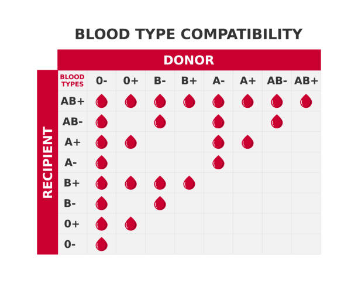

# Organ-izer Developer Guide

<!-- * Table of Contents -->
<page-nav-print />

--------------------------------------------------------------------------------------------------------------------

## **Acknowledgements**

_{ list here sources of all reused/adapted ideas, code, documentation, and third-party libraries -- include links to the original source as well }_

--------------------------------------------------------------------------------------------------------------------

## **Setting up, getting started**

Refer to the guide [_Setting up and getting started_](SettingUp.md).

--------------------------------------------------------------------------------------------------------------------

## **Design**

### Architecture

<puml src="diagrams/ArchitectureDiagram.puml" width="280" />

The ***Architecture Diagram*** given above explains the high-level design of the App.

Given below is a quick overview of main components and how they interact with each other.

**Main components of the architecture**

**`Main`** (consisting of classes [`Main`](https://github.com/AY2526S1-CS2103T-T17-3/tp/tree/master/src/main/java/seedu/address/Main.java) and [`MainApp`](https://github.com/AY2526S1-CS2103T-T17-3/tp/tree/master/src/main/java/seedu/address/MainApp.java)) is in charge of the app launch and shut down.
* At app launch, it initializes the other components in the correct sequence, and connects them up with each other.
* At shut down, it shuts down the other components and invokes cleanup methods where necessary.

The bulk of the app's work is done by the following four components:

* [**`UI`**](#ui-component): The UI of the App.
* [**`Logic`**](#logic-component): The command executor.
* [**`Model`**](#model-component): Holds the data of the App in memory.
* [**`Storage`**](#storage-component): Reads data from, and writes data to, the hard disk.

[**`Commons`**](#common-classes) represents a collection of classes used by multiple other components.

**How the architecture components interact with each other**

The *Sequence Diagram* below shows how the components interact with each other for the scenario where the user issues the command `delete 1`.

<puml src="diagrams/ArchitectureSequenceDiagram.puml" width="574" />

Each of the four main components (also shown in the diagram above),

* defines its *API* in an `interface` with the same name as the Component.
* implements its functionality using a concrete `{Component Name}Manager` class (which follows the corresponding API `interface` mentioned in the previous point.

For example, the `Logic` component defines its API in the `Logic.java` interface and implements its functionality using the `LogicManager.java` class which follows the `Logic` interface. Other components interact with a given component through its interface rather than the concrete class (reason: to prevent outside component's being coupled to the implementation of a component), as illustrated in the (partial) class diagram below.

<puml src="diagrams/ComponentManagers.puml" width="300" />

The sections below give more details of each component.

### UI component

The **API** of this component is specified in [`Ui.java`](https://github.com/AY2526S1-CS2103T-T17-3/tp/tree/master/src/main/java/seedu/address/ui/Ui.java)

<puml src="diagrams/UiClassDiagram.puml" alt="Structure of the UI Component"/>

The UI component is the stakeholder responsible for the graphical user interface seen by the user.

The UI consists of a `MainWindow` that is made up of parts e.g.`CommandBox`, `ResultDisplay`, `PersonListPanel`, `StatusBarFooter` etc. All these, including the `MainWindow`, inherit from the abstract `UiPart` class which captures the commonalities between classes that represent parts of the visible GUI.

#### Overview

The `UI` component uses the JavaFx UI framework. The layout of these UI parts are defined in matching `.fxml` files that are in the `src/main/resources/view` folder. The various components are shown in the table below:

| Component | Description | FXML File |
|------------|--------------|-----------|
| `MainWindow` | The root container holding all components together. | `MainWindow.fxml` |
| `StatusBarFooter` | Shows the save location at the bottom of the application window. | `StatusBarFooter.fxml` |
| `ResultDisplay` | Shows messages for user commands for confirmation on commands being completed successfully, or errors that arose from the command. | `ResultDisplay.fxml` |
| `CommandBox` | Receives user inputs to execute commands. | `CommandBox.fxml` |
| `HelpWindow` | Shows a window that describes and gives examples for the commands available to the user. | `HelpWindow.fxml` |
| `PersonListPanel` | Shows a scrollable list of all recipient entries, where each is saved as a `PersonCard`. | `PersonListPanel.fxml` |
| `PersonCard` | Shows each field in recipient entries. | `PersonListCard.fxml` |

All the components stated above inherit from the abstract `UiPart` class, which encapsulates common functionality for JavaFX UI elements.

#### Error Handling & Validation

The UI component handles the following error scenarios:

| Rule | Description | Handling |
|------|--------------|----------|
| **Command Execution Failure** | `CommandException` thrown during command execution. | Display error message in `ResultDisplay`, highlight command box in red |
| **Invalid Command Format** | `ParseException` thrown during command parsing. | Display parse error message in `ResultDisplay`, highlight command box in red |
| **FXML Load Failure** | FXML file cannot be loaded or contains errors. | Log error and throw `AssertionError` |
| **Help Window Already Open** | User attempts to open help window when already open. | Focus existing help window instead of creating new one |
| **Empty Command Input** | User presses Enter with blank command box. | Ignore input, no action taken |
| **Invalid Tab Completion** | Tab pressed but no valid command template matches. | No completion performed, retain current text |

These error handling mechanisms ensure graceful degradation and provide clear feedback to users when issues occur.

#### Responsibilities

* **Command Execution**: Executes user commands using the `Logic` component by calling `Logic#execute(String commandText)`.
* **Data Observation**: Listens for changes to `Model` data so that the UI can be updated with the modified data.
* **Logic Integration**: Keeps a reference to the `Logic` component, because the `UI` relies on the `Logic` to execute commands.
* **Data Display**: Depends on some classes in the `Model` component, as it displays `Person` objects residing in the `Model`.

#### Design Considerations
* Dropdown format in `HelpWindow` to reduce cluttering from other more basic commands. Allows the user to see an overview of all commands available, before zooming in on details of a specific command to be used.
* Resizable window dimensions to accommodate varying screen sizes and side by side usage of the application and other tools such as the internet browser.
* Horizontally scrollable `PersonListCard` and `ResultDisplay` to allow for viewing of longer entries or messages that may exceed horizontal window dimensions. Vertically scrollable `HelpWindow` and  `PersonListPanel` to accommodate viewing descriptions of commands and recipient entries that exceed the vertical window dimensions.

### Logic component

**API** : [`Logic.java`](https://github.com/AY2526S1-CS2103T-T17-3/tp/tree/master/src/main/java/seedu/address/logic/Logic.java)

Here's a (partial) class diagram of the `Logic` component:

<puml src="diagrams/LogicClassDiagram.puml" width="550"/>

The sequence diagram below illustrates the interactions within the `Logic` component, taking `execute("delete 1")` API call as an example.

<puml src="diagrams/DeleteSequenceDiagram.puml" alt="Interactions Inside the Logic Component for the `delete 1` Command" />

<box type="info" seamless>

**Note:** The lifeline for `DeleteCommandParser` should end at the destroy marker (X) but due to a limitation of PlantUML, the lifeline continues till the end of diagram.
</box>

How the `Logic` component works:

1. When `Logic` is called upon to execute a command, it is passed to an `AddressBookParser` object which in turn creates a parser that matches the command (e.g., `DeleteCommandParser`) and uses it to parse the command.
1. This results in a `Command` object (more precisely, an object of one of its subclasses e.g., `DeleteCommand`) which is executed by the `LogicManager`.
1. The command can communicate with the `Model` when it is executed (e.g. to delete a person).<br>
   Note that although this is shown as a single step in the diagram above (for simplicity), in the code it can take several interactions (between the command object and the `Model`) to achieve.
1. The result of the command execution is encapsulated as a `CommandResult` object which is returned back from `Logic`.

Here are the other classes in `Logic` (omitted from the class diagram above) that are used for parsing a user command:

<puml src="diagrams/ParserClasses.puml" width="600"/>

How the parsing works:
* When called upon to parse a user command, the `AddressBookParser` class creates an `XYZCommandParser` (`XYZ` is a placeholder for the specific command name e.g., `AddCommandParser`) which uses the other classes shown above to parse the user command and create a `XYZCommand` object (e.g., `AddCommand`) which the `AddressBookParser` returns back as a `Command` object.
* All `XYZCommandParser` classes (e.g., `AddCommandParser`, `DeleteCommandParser`, ...) inherit from the `Parser` interface so that they can be treated similarly where possible e.g, during testing.

#### Error Handling & Validation

During command parsing and execution, the following checks ensure command validity:

| Rule | Description | Exception |
|------|--------------|-----------|
| **Unknown Command** | Command word does not match any registered commands. | `ParseException(MESSAGE_UNKNOWN_COMMAND)` |
| **Invalid Command Format** | Command arguments do not match expected format. | `ParseException(MESSAGE_INVALID_COMMAND_FORMAT)` |
| **Invalid Person Index** | Index provided is out of bounds of the displayed person list. | `CommandException(MESSAGE_INVALID_PERSON_DISPLAYED_INDEX)` |
| **Duplicate Person** | Attempting to add a person that already exists (same name and phone). | `CommandException(MESSAGE_DUPLICATE_PERSON)` |
| **Missing Prefixes** | Required prefixes (n/, p/, e/, etc.) are not provided. | `ParseException("Required prefixes missing")` |
| **Invalid Field Values** | Field values fail validation (e.g., invalid phone format, blood type). | `ParseException` with field-specific message |
| **Incomplete Emergency Contact** | Emergency contact provided with only name or phone, not both. | `ParseException(EmergencyContact.MESSAGE_CONSTRAINTS)` |
| **Emergency Contact Same as Recipient** | Emergency contact phone number matches the recipient's phone. | `ParseException(EmergencyContact.EMERGENCY_CONTACT_IS_RECIPIENT)` |

These validations ensure that only well-formed, valid commands are executed against the model.

#### Responsibilities

* **Command Parsing**: Parses user input strings into executable `Command` objects using the `AddressBookParser` and the respective command parsers.
* **Command Execution**: Executes parsed commands against the `Model` and returns a `CommandResult` containing the outcome and feedback message.
* **Exception Handling**: Throws `CommandException` for execution errors and `ParseException` for invalid command formats, which are caught and displayed to the user.
* **Command History Management**: Maintains a history of previously executed commands via `CommandHistory` for navigation with arrow keys.
* **Model-UI Bridge**: Provides the UI with access to the filtered person list and address book data through the `Logic` interface, without exposing underlying `Model` implementation.

#### Design Considerations

The following design considerations were maintained during implementation:

Command formats should be **simple and short**:
* This reflects our [non-functional](#non-functional-requirements) requirement that a non-technical user must be able to learn how to operate the app quickly.
* We split up our various search commands to simplify the work of remembering various abstract prefixes.
* For the add command which was inevitably long, we provided command completion with <kbd>Tab</kbd> to circumvent the issue.

Entering commands should be **fast**:
* This reflects our [non-functional](#non-functional-requirements) requirement that a user must be able to operate Organ-izer faster than a traditional mouse-based application.
* Adding the ability to access previously entered commands with the <kbd>Up</kbd> key saves on valuable time re-entering searches.
* Including a full command summary with the `help` command can avoid the overhead of accessing an external browser if a user simply forgets a command.
* Additionally, our command completion functionality also helps to speed up the process of adding users.

### Model component
**API** : [`Model.java`](https://github.com/AY2526S1-CS2103T-T17-3/tp/tree/master/src/main/java/seedu/address/model/Model.java)

<puml src="diagrams/ModelClassDiagram.puml" width="450" />


The `Model` component,

* stores the address book data i.e., all `Person` objects (which are contained in a `UniquePersonList` object).
* stores the currently 'selected' `Person` objects (e.g., results of a search query) as a separate _filtered_ list which is exposed to outsiders as an unmodifiable `ObservableList<Person>` that can be 'observed' e.g. the UI can be bound to this list so that the UI automatically updates when the data in the list change.
* stores a `UserPref` object that represents the user’s preferences. This is exposed to the outside as a `ReadOnlyUserPref` objects.
* does not depend on any of the other three components (as the `Model` represents data entities of the domain, they should make sense on their own without depending on other components)

<box type="info" seamless>

**Note:** An alternative (arguably, a more OOP) model is given below. It has a `Tag` list in the `AddressBook`, which `Person` references. This allows `AddressBook` to only require one `Tag` object per unique tag, instead of each `Person` needing their own `Tag` objects.<br>

<puml src="diagrams/BetterModelClassDiagram.puml" width="450" />

</box>

#### Error Handling & Validation

The Model component enforces the following constraints on person data:

| Rule | Description | Exception |
|------|--------------|-----------|
| **Duplicate Person** | Adding a person with the same name and phone as an existing person. | `DuplicatePersonException` |
| **Person Not Found** | Attempting to edit or delete a person that doesn't exist in the list. | `PersonNotFoundException` |
| **Invalid Name** | Name contains non-alphanumeric characters or is blank. | `IllegalArgumentException(Name.MESSAGE_CONSTRAINTS)` |
| **Invalid Phone** | Phone number is not exactly 8 digits. | `IllegalArgumentException(Phone.MESSAGE_CONSTRAINTS)` |
| **Invalid Email** | Email does not follow format: local-part@domain. | `IllegalArgumentException(Email.MESSAGE_CONSTRAINTS)` |
| **Invalid Blood Type** | Blood type is not one of: A+, A-, B+, B-, AB+, AB-, O+, O-. | `IllegalArgumentException(BloodType.MESSAGE_CONSTRAINTS)` |
| **Invalid Organ** | Organ is not one of: kidney, liver, heart, lungs, pancreas, cornea. | `IllegalArgumentException(Organ.MESSAGE_CONSTRAINTS)` |
| **Invalid Priority** | Priority is not an integer between 1-5. | `IllegalArgumentException(Priority.MESSAGE_CONSTRAINTS)` |
| **Invalid Tag** | Tag name contains non-alphanumeric characters or is blank. | `IllegalArgumentException(Tag.MESSAGE_CONSTRAINTS)` |

These validations maintain data integrity and prevent invalid recipient information from being stored.

####Responsibilities

* **Data Management**: Holds and manages all application data, including the `AddressBook` containing recipient information and `UserPrefs` for user preferences.
* **Data Validation**: Ensures data integrity through validation of person attributes using regex patterns.
* **Filtering and Search**: Provides predicates for filtering the person list based on various criteria such as name or organ, without exposing the underlying data structure.
* **State Persistence**: Maintains the current filter state and user preferences set from `search` commands for restoration on application restart.
* **Change Notification**: Exposes observable lists that automatically notify the UI of data changes to allow for reactive updates to the displayed information in the UI component.

### Storage component

**API** : [`Storage.java`](https://github.com/AY2526S1-CS2103T-T17-3/tp/tree/master/src/main/java/seedu/address/storage/Storage.java)

<puml src="diagrams/StorageClassDiagram.puml" width="550" />

The `Storage` component,
* can save both address book data and user preference data in JSON format, and read them back into corresponding objects.
* inherits from both `AddressBookStorage` and `UserPrefStorage`, which means it can be treated as either one (if only the functionality of only one is needed).
* depends on some classes in the `Model` component (because the `Storage` component's job is to save/retrieve objects that belong to the `Model`)

#### Error Handling & Validation

During file operations and deserialization (`JsonSerializableAddressBook#toModelType()`), the following checks ensure data consistency:

| Rule | Description | Exception |
|------|--------------|-----------|
| **Duplicate Person** | A duplicate `Person` entry exists in the JSON file. | `IllegalValueException(MESSAGE_DUPLICATE_PERSON)` |
| **Missing Required Fields** | Required JSON fields (name, phone, email, address, organ, bloodType, priority) are null or missing. | `IllegalValueException` |
| **Corrupted JSON** | JSON file is not properly formatted or cannot be parsed. | `DataLoadingException` |
| **File Not Found** | Address book or preferences file does not exist on first run. | Creates new file with empty/default data |
| **Access Denied** | Insufficient permissions to read/write storage files. | `DataLoadingException` wrapping `AccessDeniedException` |

These validations ensure that storage files are accessible, properly formatted, and do not contain duplicate entries.

#### Responsibilities

* **File Management**: Manages two separate storage files, namely `addressbook.json` for recipient data and `preferences.json` for user settings such as window size.
* **Data Conversion**: Converts between domain objects (eg. `Person` and `Tag`) and JSON-adapted objects (eg. `JsonAdaptedPerson`, `JsonAdaptedTag`) for serialisation and deserialisation.
* **Error Handling**: Handles file I/O exceptions (eg. missing files, access denied, corrupted data) and provides appropriate error messages to the application.
* **Storage Coordination**: Implements the `Storage` interface through`StorageManager` to coordinate between `AddressBookStorage` and `UserPrefsStorage` operations.

### Common classes

Classes used by multiple components are in the `seedu.address.commons` package.

--------------------------------------------------------------------------------------------------------------------

## **Implementation**

This section describes some noteworthy details on how certain features are implemented.

### Noteworthy features: Combined search and blood type compatibility

We added two new commands to support organ transplant coordination workflows that require combining multiple criteria and reasoning about blood type compatibility.

- Combined search with AND semantics across criteria:
  - Exact name match (case-insensitive)
  - Organ substring
  - Blood type recipient-compatibility (find donors who can donate to specified recipient blood types)
- Compatibility search (recipient-compatibility given a donor blood type):
  - Finds all recipients whose blood type can receive from the specified donor blood type

#### Design overview

The logic flows mirror existing command parsing patterns. The `AddressBookParser` routes to dedicated parsers that build predicates and construct commands.

<puml src="diagrams/CombinedCompatibleClassDiagram.puml" width="700" />

Key points:
- `CombinedCommandParser` composes a `CombinedPredicate` from optional sub-predicates:
  - `NameExactMatchPredicate`
  - `OrganContainsSubstringPredicate`
  - `BloodTypeRecipientCompatiblePredicate`
- `CompatibleCommandParser` constructs a `BloodTypeCompatibilityPredicate` using the donor blood type.
- Both blood type compatibility predicates use a normalized, canonical matrix and compare using uppercase labels to ensure case-insensitive correctness (e.g., "b+" equals "B+").

#### Sequence of parsing and execution (Combined)

<puml src="diagrams/CombinedCommandSequenceDiagram.puml" width="700" />

1. `AddressBookParser` identifies `combined` and delegates to `CombinedCommandParser`.
2. Parser validates inputs, builds the appropriate sub-predicates, and constructs `CombinedCommand`.
3. On `execute`, `CombinedCommand` applies the combined predicate to `Model#updateFilteredPersonList` and returns a result containing either the count or a no-results message.

#### Blood type compatibility matrices (summary)

- Donor-to-recipient compatibility (used in `compatible` command):<br>

   <br>


These rules are implemented in `BloodTypeRecipientCompatiblePredicate` and `BloodTypeCompatibilityPredicate` and compared with canonical uppercase strings.

### \[Proposed\] Undo/redo feature

#### Proposed Implementation

The proposed undo/redo mechanism is facilitated by `VersionedAddressBook`. It extends `AddressBook` with an undo/redo history, stored internally as an `addressBookStateList` and `currentStatePointer`. Additionally, it implements the following operations:

* `VersionedAddressBook#commit()` — Saves the current address book state in its history.
* `VersionedAddressBook#undo()` — Restores the previous address book state from its history.
* `VersionedAddressBook#redo()` — Restores a previously undone address book state from its history.

These operations are exposed in the `Model` interface as `Model#commitAddressBook()`, `Model#undoAddressBook()` and `Model#redoAddressBook()` respectively.

Given below is an example usage scenario and how the undo/redo mechanism behaves at each step.

Step 1. The user launches the application for the first time. The `VersionedAddressBook` will be initialized with the initial address book state, and the `currentStatePointer` pointing to that single address book state.

<puml src="diagrams/UndoRedoState0.puml" alt="UndoRedoState0" />

Step 2. The user executes `delete 5` command to delete the 5th person in the address book. The `delete` command calls `Model#commitAddressBook()`, causing the modified state of the address book after the `delete 5` command executes to be saved in the `addressBookStateList`, and the `currentStatePointer` is shifted to the newly inserted address book state.

<puml src="diagrams/UndoRedoState1.puml" alt="UndoRedoState1" />

Step 3. The user executes `add n/David …​` to add a new person. The `add` command also calls `Model#commitAddressBook()`, causing another modified address book state to be saved into the `addressBookStateList`.

<puml src="diagrams/UndoRedoState2.puml" alt="UndoRedoState2" />

<box type="info" seamless>

**Note:** If a command fails its execution, it will not call `Model#commitAddressBook()`, so the address book state will not be saved into the `addressBookStateList`.

</box>

Step 4. The user now decides that adding the person was a mistake, and decides to undo that action by executing the `undo` command. The `undo` command will call `Model#undoAddressBook()`, which will shift the `currentStatePointer` once to the left, pointing it to the previous address book state, and restores the address book to that state.

<puml src="diagrams/UndoRedoState3.puml" alt="UndoRedoState3" />


<box type="info" seamless>

**Note:** If the `currentStatePointer` is at index 0, pointing to the initial AddressBook state, then there are no previous AddressBook states to restore. The `undo` command uses `Model#canUndoAddressBook()` to check if this is the case. If so, it will return an error to the user rather
than attempting to perform the undo.

</box>

The following sequence diagram shows how an undo operation goes through the `Logic` component:

<puml src="diagrams/UndoSequenceDiagram-Logic.puml" alt="UndoSequenceDiagram-Logic" />

<box type="info" seamless>

**Note:** The lifeline for `UndoCommand` should end at the destroy marker (X) but due to a limitation of PlantUML, the lifeline reaches the end of diagram.

</box>

Similarly, how an undo operation goes through the `Model` component is shown below:

<puml src="diagrams/UndoSequenceDiagram-Model.puml" alt="UndoSequenceDiagram-Model" />

The `redo` command does the opposite — it calls `Model#redoAddressBook()`, which shifts the `currentStatePointer` once to the right, pointing to the previously undone state, and restores the address book to that state.

<box type="info" seamless>

**Note:** If the `currentStatePointer` is at index `addressBookStateList.size() - 1`, pointing to the latest address book state, then there are no undone AddressBook states to restore. The `redo` command uses `Model#canRedoAddressBook()` to check if this is the case. If so, it will return an error to the user rather than attempting to perform the redo.

</box>

Step 5. The user then decides to execute the command `list`. Commands that do not modify the address book, such as `list`, will usually not call `Model#commitAddressBook()`, `Model#undoAddressBook()` or `Model#redoAddressBook()`. Thus, the `addressBookStateList` remains unchanged.

<puml src="diagrams/UndoRedoState4.puml" alt="UndoRedoState4" />

Step 6. The user executes `clear`, which calls `Model#commitAddressBook()`. Since the `currentStatePointer` is not pointing at the end of the `addressBookStateList`, all address book states after the `currentStatePointer` will be purged. Reason: It no longer makes sense to redo the `add n/David …​` command. This is the behavior that most modern desktop applications follow.

<puml src="diagrams/UndoRedoState5.puml" alt="UndoRedoState5" />

The following activity diagram summarizes what happens when a user executes a new command:

<puml src="diagrams/CommitActivityDiagram.puml" width="250" />

#### Design considerations:

**Aspect: How undo & redo executes:**

* **Alternative 1 (current choice):** Saves the entire address book.
  * Pros: Easy to implement.
  * Cons: May have performance issues in terms of memory usage.

* **Alternative 2:** Individual command knows how to undo/redo by
  itself.
  * Pros: Will use less memory (e.g. for `delete`, just save the person being deleted).
  * Cons: We must ensure that the implementation of each individual command are correct.

* **Alternative 3:** Save changes to address book as a separate log.
  * Pros: Will use less memory (e.g. for `edit`, just remember the changes to the specific person).
  * Cons: The implementation of a `diff` and rollback operations can be complex.

#### Future Extensions

* **Change Summary** - complement undo operations by allowing the user to view what will be undone.
* **Accountability** - keep track of the user modifying the address book to maintain accountability
* **Change Audits** - export a summary of all changes into an `.xlsx` file for auditing purposes

### \[Proposed\] Importing of Excel Spreadsheets

#### Proposed Implementation

This feature allows users to **bulk-import contact and organ donor data from an Excel (.xlsx) file** into the application’s address book. It aims to streamline data entry workflows for organizations that maintain donor information in spreadsheet form, such as hospitals or medical coordinators.

<puml src="diagrams/ImportExcelObjectDiagram.puml" width="700" />  

The import process involves reading Excel sheets, validating their contents, and converting rows into `Person` objects that the `Model` can store.

**Key operations:**

* `ImportCommand#execute()` — handles user invocation of the `import` command, e.g. `import f/data.xlsx`
* `ExcelReader#readExcelFile(Path filePath)` — reads `.xlsx` files using Apache POI (or a similar library)
* `ExcelParser#parseRows(List<Row> rows)` — parses each row, validates format, and converts them into `Person` entities
* `Model#addPerson(Person person)` — adds each parsed `Person` to the in-memory `AddressBook`
* `Storage#saveAddressBook(ReadOnlyAddressBook)` — persists the imported data

#### Example user workflow

1. The user places an Excel file (e.g. `donors.xlsx`) in the application directory.
2. The user enters:
   ```  
   import f/donors.xlsx  
   ```  
3. The app reads the spreadsheet, validates each entry, and adds new records to the address book.
4. The UI displays a summary message such as:
   ```  
   25 entries imported successfully. 2 rows skipped due to validation errors.  
   ```  

#### Expected Excel format

The Excel file is expected to contain a header row with the following columns:

| Column | Example Value | Description |  
|--------|----------------|-------------|  
| Name | John Doe | Full name of the person |  
| Phone | 91234567 | Contact number |  
| Email | johnd@example.com | Valid email address |  
| Address | 123 Clementi Ave 3 | Home address |  
| Blood Type | O+ | Must match recognized types (O+, A−, etc.) |  
| Organ | Kidney | Organ available or required |  
| Emergency Contact | 91234567 | Contact number |

**Optional extensions:**
* Additional columns (e.g., “Donor/Recipient” status or “Notes”) may be supported later.
* Missing optional fields are defaulted to empty strings.

#### Validation and error handling

The system enforces strict input validation to maintain data integrity:
* Rows with missing mandatory fields (e.g. Name, Blood Type) are skipped.
* Invalid blood types or malformed emails are logged as warnings.
* The command result summarizes both successful and failed imports.

Each skipped row produces a corresponding warning in the log:
```  
[WARN] Row 17: Invalid blood type 'Z+' – skipped.  
```  

#### Sequence of interactions

1. `LogicManager` parses the `import` command and creates an `ImportCommand` object.
2. `ImportCommand#execute()` calls `ExcelReader#readExcelFile()`.
3. `ExcelReader` uses Apache POI to read the `.xlsx` workbook and return its rows.
4. `ExcelParser` validates and converts each row into a `Person`.
5. Valid persons are passed to `Model#addPerson()`, which updates the in-memory data.
6. `Storage#saveAddressBook()` persists the updated state.

<puml src="diagrams/ImportExcelDetailedSequence.puml" width="750" />  

#### Design considerations

**Aspect: How data is read from Excel**

* **Alternative 1 (current choice):** Use Apache POI.
    * Pros: Mature library, supports `.xlsx`, handles cell types robustly.
    * Cons: Slightly higher memory footprint for large spreadsheets.

* **Alternative 2:** Convert `.xlsx` to `.csv` before import and use existing text parsing logic.
    * Pros: Simpler and lighter implementation.
    * Cons: Requires extra preprocessing by users and may lose formatting.

**Aspect: Handling duplicates**

* **Alternative 1 (current choice):** Skip duplicates based on identical name and phone.
    * Pros: Prevents accidental overwriting of existing data.
    * Cons: May miss legitimate updates.

* **Alternative 2:** Overwrite existing entries.
    * Pros: Simplifies synchronization for updated records.
    * Cons: Risk of unintended data loss.

#### Future extensions

* **Export to Excel** — complement import by providing a way to export all contacts back into an `.xlsx` file.
* **Interactive conflict resolution** — prompt the user when duplicates or data inconsistencies are detected.
* **Partial rollback** — implement atomic batch imports (commit all or none).
* **GUI integration** — allow file selection via a graphical file chooser.

### \[Proposed\] Organ Swap Systems

An **organ donation swap** is a program that helps **recipients** who need an organ transplant but have a willing **donor** who **isn’t a suitable** match for them.
Here’s how it works:
Suppose **Person A** needs a kidney, and **Donor A** wants to donate to them—but their blood types are **non-compatible**.


Meanwhile,**Person B** also needs a kidney, and **Donor B** wants to donate to them but their blood types are also **non-compatible**.


However, **Donor A** is a match for **Person B**, and **Donor B** is a match for **Person A**.


So, the donors **swap.** **Donor A** gives a kidney to **Person B**, and **Donor B** gives a kidney to **Person A**.This way, **both patients** receive **compatible** kidneys, even though their original donors couldn’t directly help them.
Our proposed feature would process such **swaps** between 2 donor-recipient pairs, 3-way swaps and other variations of n-way swaps.
Each **pair** consists of a **donor** and a **recipient.**
If the algorithm manages to find a **swap**, then a `Swap` object is created.
The diagram below illustrates the relationships between the various objects involved in a 3-way kidney exchange.
<br><br>

<br><br>


The organ swap process involves adding donor-recipient pairs, evaluating blood type and organ compatibility, generating possible exchange chains.

**Key operations:**

* `LogicManager#execute(String)`: handles parsing the user command to begin adding the new recipient-donor pair.
* `Model#addPair(Recipient, Donor)`: stores the input pair in memory and persists via storage.
* `CompatibilityEngine#findSwap()`: computes all possible swap chains based on compatibility rules and retrieved pairs from the model.
* `Model#getPairs()`: retrieves all registered pairs for matching.


#### Data model

Each `DonorRecipientPair` contains:

| Attribute | Description |
|-----------|-------------|
| Donor | Reference to `Donor` object |
| Recipient | Reference to `Recipient` object |
| Donor.bloodType | Blood type of donor |
| Donor.willingOrgan | Organ available for donation |
| Recipient.bloodType | Blood type of recipient |
| Recipient.requiredOrgan | Organ required |
| Recipient.priority | Priority for organ allocation |

--------------------------------------------------------------------------------------------------------------------

## **Documentation, logging, testing, configuration, dev-ops**

* [Documentation guide](Documentation.md)
* [Testing guide](Testing.md)
* [Logging guide](Logging.md)
* [Configuration guide](Configuration.md)
* [DevOps guide](DevOps.md)

--------------------------------------------------------------------------------------------------------------------

## **Appendix: Requirements**

### Product scope

**Target user profile**:

* has a need to manage a significant number of recipients which need donors
* prefer desktop apps over other types
* can type fast
* prefers typing to mouse interactions
* is reasonably comfortable using CLI apps

**Value proposition**: Organ donation is time-critical and requires a recipient to be present within hours of organ availability.
 Organ-izer provides fast and efficient means to navigate the database quickly to identify a suitable recipient.
 Thereby, solving coordination and prioritization challenges that donor coordinators face.


### User stories

Priorities: High (must have) - `* * *`, Medium (nice to have) - `* *`, Low (unlikely to have) - `*`

| Priority | As a …                                    | I want to …                                 | So that I can…                                                        |
|----------|--------------------------------------------|---------------------------------------------|------------------------------------------------------------------------|
|`***`|Organ transplant coordinator| add recipients to my database               |contact them when an organ is available
|`**`|Organ transplant coordinator|minimise typing when adding recipients|add recipients quickly
|`**`|Organ transplant coordinator| edit recipient details                      |update old recipient details
|`***`|Organ transplant coordinator| delete recipients from my database          |clear discharged recipients from the database
|`***`|Organ transplant coordinator| list all recipients                   |inspect individual recipient details
|`***`|Organ transplant coordinator| search up recipients by organ                    |contact them should that organ become available
|`**`|Organ transplant coordinator| search up recipients by priority              |prioritise recipients whose condition is dire
|`**`|Organ transplant coordinator| search up recipients by compatible blood type |ensure recipient is suitable to receive from donor
|`**`|Organ transplant coordinator|search up patients by multiple criteria simultaneously(e.g., organ + blood type + urgency)|narrow down possible matches more efficiently
|`**`|Organ transplant coordinator|re-enter previous commands without needing to retype them|I can redo commands quickly when I make mistakes
|`**`|Organ transplant coordinator|generate summaries of organs needed|discuss treatment options efficiently with medical teams


### Use cases

(For all use cases below, the **System** is the `Organ-izer` and the **Actor** is the `Coordinator`, unless specified otherwise)

**Use Case UC01: Add new recipient**
Main Success Scenario (MSS):

1. Coordinator enters add command syntax and user inputs.
2. Organ-izer validates the recipient details.
3. Organ-izer adds recipient to the database.
4. Organ-izer displays success message.
Use case ends. <br><br>

Extensions :
- 1a. Coordinator enters the <kbd> tab </kbd> key.
    1a1. Organ-izer populates command bar with the command syntax.
    1a2. User enters recipient details.
    Use case resumes from step 2.<br>
- 2a. Organ-izer detects invalid recipient details.
2a1. Organ-izer displays error message.
Use case ends.<br>
- 2b. Organizer detects duplicate recipient.
  2b1. Organ-izer displays error message.
  Use case ends.

**Use Case UC02: Edit recipient details**
Main Success Scenario (MSS):

1. Coordinator enters recipient details to change.
2. Organ-izer validates the recipient details.
3. Organ-izer updates recipient details.
4. Organ-izer displays success message.
Use case ends. <br><br>
Extensions :
- 1a. Organ-izer detects invalid recipient details.
- 1a1. Organ-izer displays error message.
  Use case ends.<br>
- 1b. Organ-izer detects invalid index.
- 1b1. Organ-izer displays error message.
  Use case ends.<br>

**Use Case UC03: Delete recipient**
Main Success Scenario (MSS):

1. Coordinator requests to delete recipient.
2. Organ-izer validates the user's request.
3. Organ-izer deletes recipient.
4. Organ-izer displays success message.<br><br>
Use case ends. <br><br>
Extensions:
- 1a User requests to delete at an invalid index
  1a1. organ-izer displays error message.
  Use case ends.<br>
- 
**Use Case UC04: View all recipients**
Main Success Scenario (MSS):

1. Coordinator requests to view all recipients.
2. Organ-izer displays a list of all recipients.
Use case ends. <br><br>

**Use Case UC05: Find recipients by organ**
1. Coordinator requests to find recipients by organ field.
2. Organ-izer validates the search criteria.
3. Organ-izer searches the system and displays recipients that match the criteria.


**Use Case UC06: Find recipients by blood type**
Same as UC05.<br>

**Use Case UC06: Find recipients by compatible blood type**
Same as UC05.<br>

**Use Case UC07: Find recipients by priority**
Same as UC05.<br>

**Use Case UC07: Find recipients by name**
Same as UC05.<br>

**Use Case UC08: Find recipients by multiple criteria**
Same as UC05.<br>

**Use Case UC08: View statistic summary**
Main Success Scenario (MSS):

1. User requests to view a summary of all recipients.
2. Organ-izer displays summary of recipients.
   Use case ends. <br><br>

**Use Case UC09: Delete all recipients**
1. Coordinator requests to delete all recipients.
2. Organ-izer deletes all recipients.
3. Organ-izer displays success message.
   Use case ends. <br><br>

**Use Case UC10: Redo previous command**
1. Coodinator requests previous command.
2. Organ-izer populates the command bar with the user's last command.


### Non-Functional Requirements

1. **Platform independence**
- The application must work on Windows, macOS and Linux and must not have OS-dependent libraries and features.
2. **Java Version Compatibility**
- The application must work on a computer that has version 17 of Java i.e., no other Java version installed.
3. **Portability**
- The application .jar file must be able to run without requiring additional installer. 
4. **No Remote Server Dependency**
- The software must not depend on any remote server for its core functionality.
5. **Screen Resolution Support**
- The GUI must work well at 1920x1080 resolution and higher (at 100% and 125% scaling), and be usable at 1280x720 and higher (at 150% scaling).
  In addition, the GUI must be usable (i.e., all functions can be used even if the user experience is not optimal) for,
  resolutions 1280x720 and higher, and at 150% scaling.
6. **Single-File Distribution**
- The application and all dependencies must be packaged into a single JAR file (or a single ZIP file if necessary).
7. **Object-Oriented Design**
- The application must primarily follow the object-oriented programming design.
8. **Human-Editable File Format**
- All data must be stored locally in a human-editable text file format.
9. **Performance**
- Must be able to hold up to 100 recipients without a noticeable sluggishness in performance for typical usage. 
  The system must be able to respond to any command within 1 second under normal conditions
10. **Reliability**
- The application must not crash during normal operations and must recover gracefully from unexpected errors.
11. **Usability**
- The application must be easy to use for healthcare professionals without technical background. (<30 minutes)
12. **Internet Independence**
- The application must be able to be used without an internet connection. Command summary must be provided in application so 
  that user will not have to refer to online documentation for regular use.

### Glossary

* **Mainstream OS**: Windows, Linux, Unix, MacOS

* **Private contact detail**: A contact detail that is not meant to be shared with others

* **Donor**: An organ donor

* **Recipient**: A recipient awaiting an organ donation

* **Tag**: A customizable label or keyword assigned to a person’s record to categorize or group similar entries (e.g., “Urgent”, “Pediatric”, “AB+ Donor”).

* **Emergency Contact**: A secondary phone number associated with a person, typically used to reach next-of-kin or responsible medical staff in urgent situations.

* **Gradle**: A build automation tool used for compiling, testing, packaging, and managing dependencies of the application.

* **FXML**: An XML-based markup language used by JavaFX to define the structure of user interfaces.

* **Predicate**: A condition or logical test used to filter or match entries based on specific attributes (e.g., name, organ, or blood type).

* **Model**: The component responsible for managing the in-memory data of the application.

* **Logic**: The component that interprets user commands and updates the model accordingly.

* **UI (User Interface)**: The visible part of the application that displays information and accepts user input.

* **Storage**: The component that reads from and writes to persistent storage (e.g., JSON, Excel files).

* **User Preferences**: Configuration data that stores user-specific settings (e.g., GUI layout, file paths).

* **Apache POI**: A Java library used for reading and writing Microsoft Excel (.xlsx) files.

* **CLI (Command Line Interface)**: A text-based interface through which the user interacts with the application by typing commands.

* **Compatibility Matrix**: A reference table defining valid donor-to-recipient blood type compatibility mappings.

* **ObservableList**: A list that allows UI components to automatically update when data changes.

--------------------------------------------------------------------------------------------------------------------
## **Appendix: Enhancements

1. **Implement more extensive filter cache**. Currently, our program saves the filtered list of only the last `search` command executed by user.
   We plan to store the resulting filtered lists of all our various filtering functions such that users can refer to previous filtered results easily through a key command.

2. **Include tab completion for all commands templates.** Currently, our <kbd>tab</kbd> completion feature is only implemented for the `add` command.
   We plan to implement tab completion feature for all relevant commands such as `combined`, `edit`, etc, such that users will not have to get caught up in remembering the syntax, and can simply press tab to quickly autofill all prefixes.

3. **Combine all our various search commands into one function.** Currently, we have different commands like `bloodtype`, `compatible`, `organ` to search for
   recipients using various filters. Our plan is to make a universal search function that will incorporate flags and 
   allow users to filter by whichever fields and strictness (exact match, partial match, fuzzy search), they want to.

4. **Extend the functionality of the last command feature.** Currently, users can press the <kbd>Up</kbd> arrow key to access the last executed command.
   We intend to extend the feature to store more commands, such that pressing the <kbd>Up</kbd> arrow key multiple times, will allow users to navigate
   all previous commands, saving time.

5. **Provide a more comprehensive summary feature.** Currently, our summary feature only displays a statistic of how many recipients require each organ.
   We plan to do a breakdown in terms of blood type as well as priority, making use of visual aids (charts, diagrams). This will allow an organ donor coordinator to easily visualize the distribution of
   recipients by the various metrics to make more informed logistical and medical decisions.
.
6. 
## **Appendix: Instructions for manual testing**

Given below are instructions to test the app manually.

<box type="info" seamless>

**Note:** These instructions only provide a starting point for testers to work on;
testers are expected to do more *exploratory* testing.

</box>

### Launching

1. Initial launch
   
  1. Test case: Download the jar file and copy into an empty folder. Double click the jar file.<br>
     Expected: Shows the GUI with a set of sample patients. The window size may not be optimum.
     
3. Saving window preferences
   
  1. Test case: Resize the window to be optimum. Move the window to a different location. Reopen the app.<br>
     Expected: The most recent windown size and location is retained.

### Shutting down

1. Shutting down
   
   1. Prerequisites: Open the app. Maybe executed a few commands.
   2. Test case: Shutdown the app by the `exit` command.<br>
      Expected: The app shuts down.

### Adding a person

1. Adding a person
   
   1. Prerequisites: Open the app. Maybe executed a few commands.
   2. Test case: Add a sample person by `add n/Alice p/12345678 e/alice@gmail.com a/alice road o/liver b/O- r/5`.<br>
      Expected: Successfully added `Alice` into the addressbook. A message `New person added: ...` shown in the status bar.

### Deleting a person

1. Deleting a person from a non-empty addressbook

   1. Prerequisites: The addressbook list is non-empty. 
   2. Test Case: Delete the first person by `delete 1`.<br>
      Expected: Successfully deleted the first person in the list. A message `Deleted Person: ...` shown in the status bar.
   3. Test case: Execute `delete` with no index parameter.<br>
      Expected: Error message `Invalid command format! delete: Deletes the person identified by the index number used in the displayed person list. Parameters: INDEX (must be a positive integer)` shown in the status bar.

2. Deleting a person from a empty addressbook

   1. Prerequisites: The addressbook list is empty.
   2. Test case: Execute `delete 1`.<br>
      Expected: Error message `The person index provided is invalid` shown in the status bar.

### Editing a person

1. Editing a person in a non-empty addressbook

   1. Prerequisites: The addressbook list is non-empty.
   2. Test case: Edit the first person by `edit 1 n/Bob`.<br>
      Expected: The first person's name changes to `Bob`. A message `Edited Person: Bob ...` shown in the status bar.
   3. Test case: Execute `edit 1` with no parameters.<br>
      Expected: Error message `At least one field to edit must be provided` shown in the status bar.

2. Editing a person in a empty addressbook

   1. Prerequisites: The addressbook list is empty.
   2. Test case: Execute `edit 1 n/Bob`.<br>
      Expected: Error message `The person index provided is invalid` shown in the status bar.

### Listing all persons

1. Listing all persons

   1. Prerequisites: The app is open.
   2. Test case: List all persons by `list`.<br>
      Expected: Shows the list of all persons in the addressbook, sorted by their priority. In case of same priority, they are sorted lexicographically by their names. A message `Listed all persons` shown in the status bar.

### Summarising all organs and patients

1. Summarising all organs and patients

   1. Prerequisites: The app is open.
   2. Test case: Show the summary by `summary`.<br>
      Expected: In the status bar, the number of patients requiring each organ is shown. The total number of patients is shown.

### Clearing the addressbook

1. Clearing the addressbook

   1. Prerequisites: The app is open.
   2. Test case: Clear the addressbook by `clear`.<br>
      Expected: All entries in the addressbook is cleared. A message `Address book has been cleared!` shown in the status bar.

### Finding all persons by name

1. Finding all persons by name

   1. Prerequisites: Multiple persons present in the addressbook, perhaps with same names.
   2. Test case: Find all persons named `alice` by `search alice`.<br>
      Expected: Listed all persons named `alice`. A message `x persons listed!` shown in the status bar, where `x` is the number of persons found.
   3. Test case: Find all persons named `alice` or `bob` by `search alice bob`.<br>
      Expected: Listed all persons named `alice` or `bob`. A message `x persons listed!` shown in the status bar, where `x` is the number of persons found.

### Finding all persons by blood type

1. Finding all persons by blood type

   1. Prerequisites: Multiple persons present in the addressbook, perhaps with same blood types.
   2. Test case: Find all persons with blood type `O+` by `bloodtype O+`.<br>
      Expected: Listed all persons with blood type `O+`. A message `x persons listed!` shown in the status bar, where `x` is the number of persons found.
   3. Test case: Find all persons with blood type `O+` or `AB-` by `bloodtype O+ AB-`.<br>
      Expected: Listed all persons with blood type `O+` or `AB-`. A message `x persons listed!` shown in the status bar, where `x` is the number of persons found.

### Finding all persons by organ

1. Finding all persons by organ

   1. Prerequisites: Multiple persons present in the addressbook, perhaps with same organs.
   2. Test case: Find all persons whose organ contains the substring `liver` by `organ liver`.<br>
      Expected: Listed all persons whose organ contains the substring `liver`. A message `x persons listed!` shown in the status bar, where `x` is the number of persons found.
   3. Test case: Find all persons whose organ contains the substring `liver` or `kidney` by `organ liver kidney`.<br>
      Expected: Listed all persons whose organ contains the substring `liver` or `kidney`. A message `x persons listed!` shown in the status bar, where `x` is the number of persons found.
      
### Finding all persons by priority

1. Finding all persons by priority

   1. Prerequisites: Multiple persons present in the addressbook, perhaps with same priorities.
   2. Test case: Find all persons whose priority is `1` by `priority 1`.<br>
      Expected: Listed all persons whose priority is `1`. A message `x persons listed!` shown in the status bar, where `x` is the number of persons found.
   3. Test case: Find all persons whose priority is `1` or `3` by `priority 1 3`.<br>
      Expected: Listed all persons whose priority is `1` or `3`. A message `x persons listed!` shown in the status bar, where `x` is the number of persons found.

### Finding all persons compatible

1. Finding all persons compatible

   1. Prerequisites: Multiple persons present in the addressbook, perhaps with same blood types.
   2. Test case: Find all persons compatible with `O-` by `compatible O-`.<br>
      Expected: Listed all persons compatible with `O-`. A message `x persons listed!` shown in the status bar, where `x` is the number of persons found.
      
### Finding all persons satisfying multiple criteria

1. Finding all persons satisfying multiple criteria

   1. Prerequisites: Multiple persons present in the addressbook.
   2. Test case: Find all persons with name `Alice` or `Bob`, with blood type `A+` or `B-`, having `kidney` as a substring in their organ by `combined n/Alice Bob b/A+ B- o/kidney`.<br>
      Expected: Listed all persons satisfying all criteria. A message `x persons listed!` shown in the status bar, where `x` is the number of persons found.

### Help

1. Opening the help page:

   1. Prerequisites: The app is open.
   2. Test case: open the help page by `help`.<br>
      Expected: The help page is automatically opened as another window. Clicking on any of the drop-downs reveals the documentation of the corresponding command.
      
## Command summary

#### Viewing Recipients

Action  | Format, Examples
-----------|----------------------------------------------------------------------------------------------------------------------------------------------------------------------
**List all recipients**   | `list`
**Summary of organs needed**   | `summary`
**Filter recipients by blood type**   | `bloodtype BLOOD_TYPE [MORE_BLOOD_TYPES]...`, eg. `bloodtype A+ B+`
**Filter recipients by organ**   | `organ ORGAN`, eg. `organ liver`
**Filter recipients by priority**   | `priority PRIORITY [MORE_PRIORITIES]...`, eg. `priority 1 2 3`
**Search for a recipient by name**   | `search KEYWORD [MORE_KEYWORDS]...`, eg. `search John`
**Combined search using name, organ, and/or blood type**   | `combined [n/NAME] [o/ORGAN] [b/BLOOD_TYPE]`, eg. `combined n/Alice o/kidney b/O+`
**Find recipients compatible with a blood type**   | `compatible BLOOD_TYPE`, eg. `compatible O-`

#### Modifying Recipients

Action  | Format, Examples
-----------|----------------------------------------------------------------------------------------------------------------------------------------------------------------------
**Add a recipient**     | `add n/NAME p/PHONE e/EMAIL a/ADDRESS o/ORGAN b/BLOOD_TYPE r/PRIORITY [en/EMERGENCY_NAME] [ep/EMERGENCY_PHONE] [er/EMERGENCY_RELATION] [t/TAG]...` <br> e.g., `add n/John Doe p/98765432 e/johnd@example.com a/311, Clementi Ave 2, #02-25 o/kidney b/O+ r/1 en/Jane Doe ep/91234567 er/spouse t/wife t/owesMoney`
**Delete a recipient** | `delete INDEX`<br> e.g., `delete 3`
**Edit a recipient’s details**   | `edit INDEX [n/NAME] [p/PHONE] [e/EMAIL] [a/ADDRESS] [o/ORGAN] [b/BLOOD TYPE] [r/PRIORITY] [en/EMERGENCY_NAME] [ep/EMERGENCY_PHONE] [er/EMERGENCY_RELATION] [t/TAG]...`<br> e.g.,`edit 2 n/James Lee e/jameslee@example.com`
⚠️ **Clear all recipients**  | `clear` Note: **this will clear all recipients in the application.**

#### Utility Functions
Action  | Format, Examples
-----------|----------------------------------------------------------------------------------------------------------------------------------------------------------------------
**Access Last Command** | <kbd>Up</kbd> key
**Exit the application**   | `exit`
**View help** | `help`

### Appendix: Effort

#### Difficulty Level

While Organ-izer builds upon the AddressBook Level 3 (AB3) foundation, which provided a systematic MVC architecture and basic CRUD operations, the application required substantial extensions to meet the specialized needs of organ transplant coordination.  
  
The core challenge lay in implementing **domain-specific medical logic** that AB3 was not originally designed to handle. Unlike a simple contact management system, Organ-izer required implementing complex **blood type compatibility matrices** (8x8 donor-recipient mappings) with case-insensitive validation, **multi-criteria filtering** through composite predicates that combine name, organ, and blood type matching with AND semantics, and **priority-based urgency rankings** for time-critical medical decisions. Additionally, the application needed to maintain **referential integrity** for emergency contacts while preventing self-referencing (a recipient cannot be their own emergency contact), validate medical data against strict domain constraints (valid organs, blood types, phone formats), and handle **nested predicate composition** for the combined search feature. The UI also required several enhancements beyond AB3's basic list display, such as the **horizontally scrollable** cards for long medical records, or the dropdown-style **help window** to reduce clutter.  
  
These domain-specific requirements, coupled with maintaining AB3's architectural principles (separation of concerns, defensive programming, comprehensive testing), made Organ-izer substantially more complex than a typical AB3 extension, requiring a deep understanding of both software design patterns and healthcare coordination workflows.  
  
#### Challenges Faced

* **Unexpected Bug Findings**: During development and testing, we encountered several edge cases that weren't initially anticipated. For instance, the blood type compatibility logic initially failed when users entered mixed-case inputs (e.g., "aB+" vs "AB+"), requiring us to implement comprehensive case-insensitive validation. These instances arose in separate occasions such as mixed-case input organ fields as well. Furthermore, overlooked components such as the `ResultDisplay` caused other bugs to surface such as edits to emergency contact fields not being shown in the result panel but are still displayed in the `PersonListPanel`.
* **Lack of Experience in Medical Contexts**: None of our team members had prior experience with healthcare systems or organ transplant coordination workflows. This created a steep learning curve in combining our understanding of blood type compatibility rules with user friendly commands and functionalities. A balance between overly medical related logic and objective driven functionalities had to be struck before deciding on the scope of the project.
* **Testing Complexity**: Achieving comprehensive test coverage for Organ-izer proved significantly more challenging than typical AB3 extensions. The blood compatibility matrix alone required testing 64 possible donor-recipient combinations (8 blood types x 8 blood types), while the CombinedCommand needed tests for all permutations of name, organ, and blood type filters. Creating realistic test data in `TypicalPersons` that covered edge cases, including different blood types, all priority levels, various organs, valid and invalid emergency contacts, required careful planning. Maintaining test maintainability while achieving ~80% coverage demanded disciplined use of test utilities and avoiding overly coupled tests that would break with implementation changes.
* **Time Management**: Coordinating five team members, with external commitments, working on parallel features while meeting weekly milestones proved challenging. We faced several Git merge conflicts when multiple members simultaneously modified core files like JsonAdaptedPerson, AddressBookParser, and PersonBuilder. Feature dependencies (e.g., CompatibleCommand requiring blood type validation, CombinedCommand depending on existing filter predicates) meant some tasks blocked others, requiring careful task sequencing. Additionally, underestimating the complexity of certain features, particularly the edits needed to create new fields and commands, led to schedule adjustments. Balancing feature implementation with comprehensive testing and documentation within the project timeframe required prioritization decisions and sometimes deferring "nice-to-have" features to ensure core functionality was robust and well-tested.

#### Effort and Achievements

Despite facing several challenges, our group was overcomeable to complete our Organ-izer
* **Product Delivery**: Delivered a working product that satisfies key objectives of aiding Organ Transplant coordinators attain speed and accuracy in their work.
* **Preservation of architecture**: Successfully extended AB3’s immutable model design while incorporating medical workflows such as filtering recipients by organ or blood type.
* **Utility and Functionality**: Added on functionalities to improve User Experience (UX) such as Tab key auto completions to provide ease in keying in commands, and commands for statistical summaries to give an overview over the recipients in the application database.
* **Comprehensive Testing**: Ensured testing robustness with over 200+ unit and integration tests on the Organ-izer functionalities.  
  
With these achievements, an effective and comprehensive application is developed to aid in organ transplant medical workflows.

#### Reuse of Existing Components

Organ-izer benefited significantly from reusing AddressBook Level 3's foundational architecture, which reduced development effort by approximately 40-50%.  
  
The core infrastructure components were largely retained with minimal modifications:  
* The Storage layer (JSON serialization/deserialization framework, file I/O utilities) required only extensions for new fields like emergency contacts and blood types.
* The UI framework (JavaFX setup, FXML structure, UiManager, UiPart, status bar) was reused entirely with only component-level customizations to PersonCard and addition of HistoryNavigator.
* The Model architecture (ModelManager, AddressBook, observer patterns) provided the foundation for extending person attributes without redesigning core data management.
* Commons utilities (StringUtil, CollectionUtil, JsonUtil, configuration management) were used as-is for validation and data manipulation.
* The Logic layer structure (command pattern, parser architecture, LogicManager) was preserved, allowing us to focus on implementing domain-specific commands (CompatibleCommand, CombinedCommand, OrganCommand) rather than building command execution infrastructure from scratch.
* The testing framework (JUnit setup, test utilities, integration test patterns) and build configuration (Gradle, CI/CD, checkstyle) were inherited directly, saving substantial setup time.  
  
This reuse allowed the development team to concentrate effort on the challenging 50-60%: implementing medical domain logic (blood compatibility algorithms, emergency contact validation, priority systems), designing complex multi-criteria search predicates, creating enhanced UI components for medical data display, and ensuring data integrity for healthcare workflows—rather than reinventing basic CRUD operations and application infrastructure.  
  
Breakdown of effort saved:
* **Storage layer**: ~80% reused (only extended JsonAdaptedPerson for new fields)
* **UI framework**: ~70% reused (kept MainWindow, UiManager, FXML structure, but customized PersonListCard and HelpWindow)
* **Model architecture**: ~60% reused (kept ModelManager, observer pattern; extended Person class)
* **Logic structure**: ~50% reused (kept command/parser framework; added new commands)
* **Commons/Utils**: ~95% reused (validation, JSON, configuration utilities used as-is)
* **Testing framework**: ~85% reused (test structure, utilities; added domain-specific tests)
* **Build/CI**: ~100% reused (Gradle, GitHub Actions, checkstyle configuration)  
  
Overall estimate: 40-50% development effort saved, allowing focus on domain-specific medical logic and user experience enhancements.

#### Summary

The development of Organ-izer demonstrates that building a specialized medical application on top of AB3 requires a careful balance between leveraging existing infrastructure and implementing domain-specific innovations. While AB3's solid architectural foundation saved our team approximately **40-50% of development effort**, the remaining **50-60%** demanded significant original work to address the unique challenges of organ transplant coordination. Although several challenges were faced that may have hindered the development process and efficiency, the team has still provided a functional and effective product that covers the identified and targeted needs from organ transplant coordinators.
