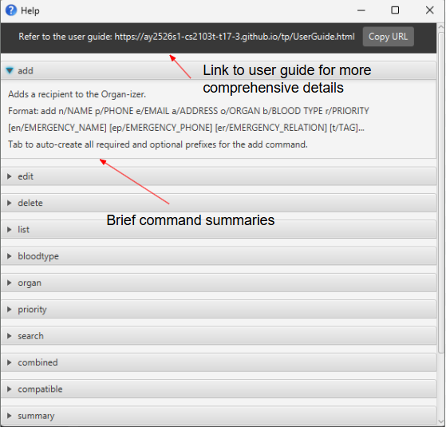
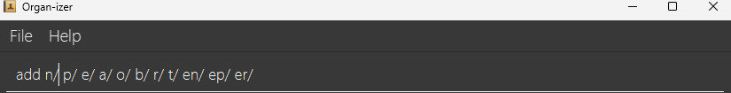
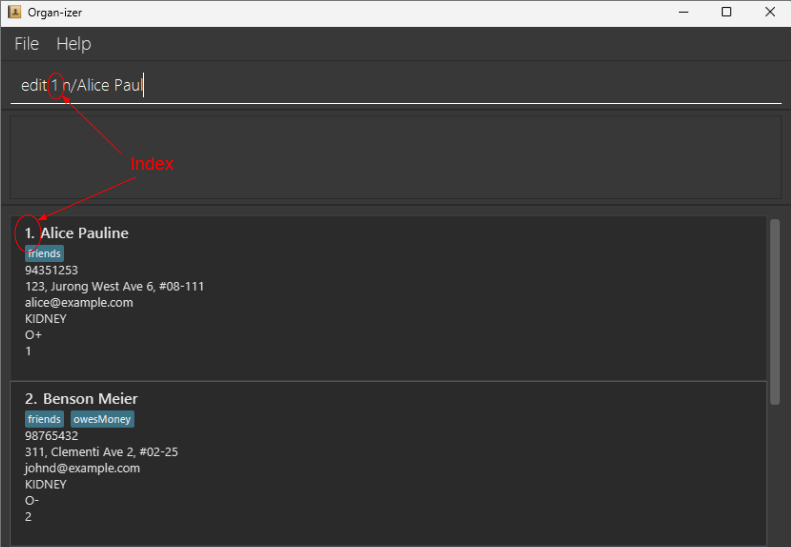

# Organ-izer User Guide

**Organi-zer** is a desktop application that **manages a database of organ donor recipients**.
It is intended for **organ donation coordinators** who require an **easy, fast, and efficient** way to
**navigate a database** and find the **right recipient**, during the **short time window** that an organ is available for donation.

If you are an **organ donation coordinator** at a healthcare facility, **Organ-izer** allows you to:

* **Easily** view your list of potential organ recipients, complete with emergency contact details, blood type, and priority.

* **Efficiently** navigate a database of potential organ recipients.

    * **Organ-izer** uses a **Command Line Interface** (CLI), which means that all functions of the application are accessible via typed commands.

    * If you can type fast, **Organ-izer** can coordinate organ donation much faster than traditional mouse-based applications.

**Organ-izer** is based on the existing [AddressBook Level 3 (AB3)](https://se-education.org/addressbook-level3/UserGuide.html) project, and is optimized for the time-critical environment under which organ donation occurs in a hospital.

<box type="info" seamless>
<markdown>
If you wish to navigate this page quickly, feel free to use the **table of contents** on the right.
</markdown>
</box>

<!-- * Table of Contents -->

<page-nav-print />

--------------------------------------------------------------------------------------------------------------------

## Quick start

1. Ensure you have Java `17` or above installed in your Computer. It can be downloaded [here](https://www.oracle.com/java/technologies/javase/jdk17-archive-downloads.html).<br>
   <box type="info" seamless>
   <markdown>
   You can **check your Java version** by following [this guide](#https://www.java.com/en/download/help/version_manual.html). <br>
   How to install Java `17`: [Windows](https://se-education.org/guides/tutorials/javaInstallationWindows.html) | [Mac](https://se-education.org/guides/tutorials/javaInstallationMac.html) | [Linux](https://se-education.org/guides/tutorials/javaInstallationLinux.html)
   </markdown>
   </box>

2. Download the latest version of `organ-izer.jar` from [here](https://github.com/AY2526S1-CS2103T-T17-3/tp/releases).

3. Make a folder and place `organ-izer.jar` into it.

4. Open a command terminal.

5. Navigate to the file using cd.

6. Enter `java -jar organ-izer.jar` command to run the application. <br>


A screen similar to the one below should be visible after a few seconds. Note that the app contains some sample data.<br><br>

<br><br>

7. To start, try typing `list` in the command box at the top and press enter to execute it.<br>
   **If it is your first time using the application, it will not display any data**.

8. To add a new user, try typing `
add n/Alice Pauline p/94351253 e/alice@example.com a/123, Jurong West Ave 6, #08-111 o/kidney b/O+ r/1 t/friends
`
9. A list of other commands you can try:
    * `summary` : Provides a brief statistical summary of recipients.

    * `clear` : Deletes all patients.

    * `exit` : Exits the app.

10. `Organ-izer` has many other useful commands to help with organ donation coordination. Details about all available commands can be found in the [Features](#features) section below.

<box type="info" seamless>
<markdown>
If you want to **quickly fill in the format of the `add` command**, you can press the `tab` key after typing `add` to make use of our **autofill** feature.

If you wish to see a **brief explanation** of any command, simply click on the Help tab and click `Help F1` or simply press <kbd>F1</kbd>.
</markdown>
</box>

--------------------------------------------------------------------------------------------------------------------

## Notes About Features

<box type="info" seamless>
<markdown>
**Notes about Command Format:**<br>

* Words in `UPPER_CASE` represent user inputs.<br>
  e.g. in `add n/NAME`, `NAME` is a user input, representing a recipient's **name**,<br>
  which the user can provide by entering `add n/John Doe`.

* Words in sqaure brackets, eg [t/TAG,] represent optional inputs.<br>
  To exclude an optional input, do not type the prefix of that input.
  e.g. in `n/NAME [t/TAG]` the user may enter `n/John Doe t/friend`,<br>
  or enter `n/John Doe`, if they don't wish to provide a **tag** input. <br>
  The same applies for emergency contact fields.

* Words followed by `…` after them, can be provided **multiple times**,<br>
  including **zero times**, if the user does not wish to provide an input.<br>
  e.g. in `[t/TAG]...` the user can :<br>
  1. enter `  `, if the user does not wish to provide a tag,<br>
  2. or enter `t/friend`, to provide 1 tag,<br>
  3. or enter `t/friend t/family`, to provide 2 tags etc.

* Inputs can be supplied in any order.<br>
  e.g. if the command specifies `n/NAME p/PHONE_NUMBER`, users can either, <br>
  enter `n/John p/92316570` **or** `p/92316570 n/John`.

* For commands that **don't need any user inputs** (such as `help`, `list`, `exit` and `clear`),<br>
  any user inputs entered after the command will be **ignored.**<br>
  e.g. if the user entered `help 123`, it will be interpreted as `help`.

* If you are using a PDF version of this document, be careful when copying and pasting commands that span multiple lines as space characters surrounding line-breaks may be omitted when copied over to the application.
  </markdown>
  </box>

<box type="info" seamless>
<markdown>
**Notes About User Input:**<br>

* `NAME` represents the recipient’s **name**.<br>
  Restrictions: It should contain only alphanumeric characters and spaces, and it should not be blank.

* `PHONE` represents the recipient’s **phone number**.<br>
  Restrictions: It should contain only numbers, and be exactly 8 digits in length.

* `EMAIL` should be of the format local-part@domain. and adhere to the following constraints:
1. The local-part should only contain alphanumeric characters and these special characters, excluding the parentheses, (+_.-). The local-part may not start or end with any special characters.
2. This is followed by a '@' and then a domain name. The domain name is made up of domain labels separated by periods.
   The domain name must:
    - end with a domain label at least 2 characters long
    - have each domain label start and end with alphanumeric characters
    - have each domain label consist of alphanumeric characters, separated only by hyphens, if any.
3. .com

* `ORGAN` represents the **organ** that the recipient needs.<br>
  Restrictions : It should only contain alphabetical characters or spaces, with the first character being an alphabetical.

* `BLOOD_TYPE` represents the recipient’s or donor’s **blood type**.<br>
  Restriction : It must be one of A+, A-, B+, B-, AB+, AB-, O+, O- only.

*`PRIORITY` represents the **priority** level of the recipient, with 1 being the highest priority and 5 being the lowest. <br>
Restrictions: It should be a whole number from 1 to 5.

* `EMERGENCY_NAME` represents the **name** of the recipient’s **emergency contact**.<br>
  Restrictions: It should only contain alphanumeric characters and spaces.

* `EMERGENCY_PHONE` represents the **phone number** of the recipient’s **emergency contact**.<br>
  Restrictions: It should only contain numbers, and be 8 digits long.

* `EMERGENCY_RELATIONSHIP` represents the type of **relationship** that the recipient has to the **emergency contact**.<br>
  Restrictions: It should only contain alphanumeric characters and/or symbols.

* `TAG` represents **additional information** about the recipient. e.g. tagging a contact as wheelchair-bound.<br>
  Restrictions: It should only contain alphanumeric characters.
  </markdown>
  </box>

<box type="info" seamless>
<markdown>
**Notes about Duplicate Entries:**<br>

* A new recipient with the **same phone number as an existing recipient** is considered to be a duplicate entry and cannot be added.

* A new recipient with the **same name as an existing recipient** is **not** considered to be a duplicate entry, and can be added.
  </markdown>
  </box>

--------------------------------------------------------------------------------------------------------------------

</markdown>
</box>
###Features
### Viewing help: `help`

Shows a help page with brief command descriptions.<br><br>

   <br><br>

Format: `help`

<br><br><br>

### Adding a recipient: `add`

Adds a recipient to the **Organ-izer**.

Format: `add n/NAME p/PHONE e/EMAIL a/ADDRESS o/ORGAN b/BLOOD_TYPE r/PRIORITY [en/EMERGENCY_NAME] [ep/EMERGENCY_PHONE] [er/EMERGENCY_RELATION] [t/TAG]...`

<box type="tip" seamless>
<markdown>
**Tip:** A recipient can have any number of **tags** (including 0)
</markdown>
</box>

<box type="note" seamless>
<markdown>
**Note:** Though emergency contact fields are **optional**, if `EMERGENCY_NAME is inputted, then `EMERGENCY_PHONE` **must** be inputted as well, and vice versa. This is because an emergency contact must have a name and phone number.
</markdown>
</box>

Examples:
* `add n/John Doe p/98765432 e/johnd@example.com a/311, Clementi Ave 2, #02-25 o/kidney b/O+ r/1 en/Jane Doe ep/91234567 er/spouse t/wife t/owesMoney`
<br><br>
### Tab Completion for `add` command

Auto creates all required and optional prefixes for the `add` command.

Format: Type `add` ,then press the <kbd>tab</kbd> key

<box type="note" seamless>
<markdown>
**Note:** The tab completion feature brings the cursor to the first field to be filled in.
</markdown>
</box>

Examples:
* Typing `add` followed by pressing <kbd>tab</kbd> will populate the command box as such :<br><br>
   <br><br><br>
  
### Editing a recipient : `edit`

Edits an existing recipient in **Organ-izer**.

Format: `edit INDEX [n/NAME] [p/PHONE] [e/EMAIL] [a/ADDRESS] [o/ORGAN] [b/BLOOD TYPE] [r/PRIORITY] [en/EMERGENCY_NAME] [ep/EMERGENCY_PHONE] [er/EMERGENCY_RELATION] [t/TAG]...`

<box type="note" seamless>
<markdown>
**Note:** 
* Edits the recipient at the specified `INDEX`. The index refers to the index number shown in the displayed recipient list. The index **must be a positive integer** such as 1, 2, 3, …<br><br>​

<br><br>

* **At least one** of the optional user inputs must be provided.
* Existing recipient details will be updated to the new user inputs.
* When editing **tags**, **all existing tags** of the recipient will be **removed** i.e adding of tags is not cumulative.
* You can simply remove all the recipient’s tags by typing `edit INDEX t/` without specifying any tags after it.
* An **emergency contact** can be added onto a recipient that **did not already have an emergency contact** by typing `edit INDEX [en/EMERGENCY_NAME] [ep/EMERGENCY_PHONE]`.
* **Emergency contact** details of a recipient can only be edited if the recipient **already has an emergency contact**.
* You can **remove** the recipient’s **emergency contact** by typing `edit INDEX en/ ep/`. Any emergency contact details are removed along with it.
  </markdown>
  </box>

Examples:
*  `edit 1 p/91234567 e/johndoe@example.com en/Bobby ep/12345678` Edits the phone number and email address of the 1st recipient to be `91234567` and `johndoe@example.com` respectively. This also adds an emergency contact named “Bobby” with contact number “12345678” to the recipient’s details.
*  `edit 2 n/Betsy Crower t/` Edits the name of the 2nd recipient to be `Betsy Crower` and clears all existing tags.
* `edit 1 en/ ep/` removes the emergency contact from the 1st recipient.
* <br><br><br>
### Listing all recipients : `list`

Shows a list of all recipients in the Organ-izer.

Format: `list`
<br><br><br>
### Finding recipients by name: `search`

Finds recipients in **Organ-izer** whose names contain all the given keywords, in any order.

Format: `search KEYWORD [MORE_KEYWORDS]...`

<box type="note" seamless>
<markdown>
**Note:** 
* The search is **case-insensitive**, e.g `hans` will match `Hans`.
* If there are multiple keywords, the **order does not matter.** e.g. `search Hans Bo` will match `Bo Hans`.
* Only **full words** will be matched e.g. `search Han` will not find recipient named `Hans`.
* Only recipients matching **all keywords** will be returned. e.g. `search Hans Bo` will not find Hans, but only `Hans Bo`.
</markdown>
</box>

Examples:
* `search John` will match with and display recipients named `john` and `John Doe`.
* `search Doe John` will match with and display recipients named `John Doe.
<br><br><br>
### Finding recipients by organ : `organ`

Finds and lists all recipients in **Organ-izer** whose required organ contains the ORGAN entered by the user.

Format: `organ ORGAN`

<box type="note" seamless>
<markdown>
**Note:** 
* The search will include **partial matches**. For instance `kidne` will match kidney. Words are case **insensitive**.
</markdown>
</box>

Examples:
* `organ kidne` Finds all recipients in **Organ-izer** whose organ required contains the word “kidne”, such as recipients who require a kidney.
* `organ large` Finds all recipients in **Organ-izer** whose organ required contains the word “large”, such as recipients who require a “large intestine”.

<br><br><br>
### Finding recipients by priority : `priority`

Finds and lists all recipients in **Organ-izer** whose priority matches the specified priorities.

Format: `priority PRIORITY [MORE_PRIORITIES]...`

<box type="note" seamless>
<markdown>
**Note:** 
* This command can accept multiple priority inputs to find recipients that match any of the given priority inputs.
</markdown>
</box>

Examples:
* `priority 1 2` Finds all recipients in **Organ-izer** whose priority is either `1` or `2`.
* `priority 3` Finds all recipients in **Organ-izer** whose priority is 3.

<br><br><br>

### Finding recipients by blood type : `blood type`

Finds and lists all recipients in **Organ-izer** whose blood type matches the specified blood types.

Format: `bloodtype BLOOD_TYPE [MORE_BLOOD_TYPES]...`

<box type="note" seamless>
<markdown>
**Note:** 
* The blood type is to be written in **all capital letters** to match medical conventions.
* This command can accept multiple blood type inputs to find recipients that match any of the given blood type inputs.
</markdown>
</box>

Examples:
* `bloodtype O+ A+` Finds all recipients in **Organ-izer** whose blood type is either `O+` or `A+`.
* `bloodtype AB+` Finds all recipients in **Organ-izer** whose blood type is AB+.

<br><br><br>

### Finding recipients by compatible blood types: `compatible`

Finds and lists all recipients with blood types that are **compatible** with `BLOOD_TYPE`.

Format: `compatible BLOOD_TYPE`

<box type="note" seamless>
<markdown>
**Note:** 
* Compatibility refers to whether the recipient’s blood type is such that he can **receive from**
  the provided donor `BLOOD_TYPE`, as illustrated below: <br><br>
  <br><br>
</markdown>
</box>

Examples:
* `compatible O-` Finds all recipients whose blood type is compatible with O-.


<br><br><br>


### Finding recipients by multiple criteria: `combined`

Finds and lists all recipients in **Organ-izer** that match **all** specified criteria .

Format: `combined [n/NAME] [o/ORGAN] [b/BLOOD_TYPE]`

<box type="note" seamless>
<markdown>
**Note:** 
* **At least one** of the optional user inputs must be provided, which are `NAME`, `ORGAN`, or `BLOOD_TYPE`.
</markdown>
</box>

<box type="tip" seamless>
<markdown>
**tip:** This command is for experienced users who want to combine search functionalities to create a more narrowed filter.
</markdown>
</box>

Examples:
* `combined n/Alice o/kidney b/O+` Find all recipients with name `Alice`, whose organ required contains the word “kidney”, and has blood type `O+`.
* `combined n/Bob ` Find all recipients with name `Bob`,
  `combined o/heart b/A+` Find all recipients whose organ required contains the word “heart” and has blood type `A+`.


<br><br><br>

### Deleting a recipient : `delete`

Deletes the specified recipient from **Organ-izer**.

Format: `delete INDEX`

<box type="note" seamless>
<markdown>
**Note:** 
* Deletes the recipient at the specified `INDEX`.
* The index refers to the index number shown in the displayed recipient list.
* The index **must be a positive integer** such as 1, 2, 3, …
</markdown>
</box>

Examples:
* `list` followed by `delete 2` deletes the 2nd recipient in **Organ-izer**.
* `find Betsy` followed by `delete 1` deletes the 1st recipient in the results of the `find` command.

  <br><br><br>

### ⚠️Deleting all recipients : `clear`

Deletes all recipients from **Organ-izer**.

Format: `clear`<br>

<br><br><br>

### Statistic summary : `summary`

Displays a summary of how many recipients in **Organ-izer** require each type of organ.

Format: `summary`

Examples:
* Typing `summary` and pressing <kbd>Enter</kbd> can return the following:
```
Organ Requirements Summary:
HEART           : 1 patient(s)
KIDNEY          : 1 patient(s)
LUNG            : 1 patient(s)

Total           : 3 patient(s)
```
<br><br><br>

### Access last command :

Populates command bar with the last command executed by user.

Format: Press the >kbd>Up</kbd> arrow key. 

### Exiting the program : `exit`
<br><br><br>
Exits the application.

Format: `exit`
<br><br><br>
### Restore last search

After reopening the app, search results from the last search command will be shown.

<box type="note" seamless>
<markdown>
**Note:** 
* This restoration only applies to the `search` command, and does not apply to other commands that narrow down the recipients such as `compatible` or `bloodtype`.
* Calling `list` after `search KEYWORD` will restore the list of displayed recipients back to showing all entries, so closing and reopening the app will not restore the search result.
</markdown>
</box>
<br><br>
### Saving the data

Organ-izer data is saved in the hard disk automatically after any command that changes the data. There is no need to save manually.
<br><
### Editing the data file

**Organ-izer** data is saved automatically as a JSON file `[JAR file location]/data/organ-izer.json`. Advanced users are welcome to update data directly by editing that data file.

<box type="warning" seamless>
<markdown>
**Caution:**
If your changes to the data file makes its format invalid, Organ-izer will discard all data and start with an empty data file at the next run.  Hence, it is recommended to take a backup of the file before editing it.<br>
Furthermore, certain edits can cause the Organ-izer to behave in unexpected ways (e.g., if a value entered is outside the acceptable range). Therefore, edit the data file only if you are confident that you can update it correctly.
</markdown>
</box>

<br><br><br>
--------------------------------------------------------------------------------------------------------------------

## FAQ

**Q**: How do I transfer my data to another Computer?<br>
**A**: Install the app in the other computer and overwrite the empty data file it creates with the file that contains the data of your previous Organ-izer home folder.

**Q**: Why are phone numbers with more or less than 8 digits not allowed?<br>
**A**: The application is based in Singapore, where phone number formats are only 8 digits. Although other countries may have 8 digit phone numbers as well, such as Thailand, the app is still only used by individuals who are currently in Singapore. The 8 digit rule is to prevent mishaps by users such as double pressing a digit or skipping past a digit accidentally.

**Q**: Must a recipient have an associated emergency contact?<br>
**A**: No, generally a recipient need not have an associated emergency contact, although ideally it would be good to have.

**Q**: If the help page provides command descriptions, what is the point off the user guide?<br>
**A**: The help page provides brief descriptions of features and their command syntax. Users are advised to refer to the user guide for a more comprehensive and nuanced explanation of features.

**Q**: How do I add a recipient without a phone number, e.g. children?<br>
**A**: Add the child recipient normally, but input his parent's phone number instead.
--------------------------------------------------------------------------------------------------------------------
<br>
## Known issues

1. **When using multiple screens**, if you move the application to a secondary screen, and later switch to using only the primary screen, the GUI will open off-screen. The remedy is to delete the `preferences.json` file created by the application before running the application again.
2. **If you minimize the Help Window** and then run the `help` command (or use the `Help` menu, or the keyboard shortcut `F1`) again, the original Help Window will remain minimized, and no new Help Window will appear. The remedy is to manually restore the minimized Help Window.

--------------------------------------------------------------------------------------------------------------------

<br><br>
## Command summary

#### Viewing Recipients

Action 	| Format, Examples
-----------|----------------------------------------------------------------------------------------------------------------------------------------------------------------------
**List all recipients**   | `list`
**Summary of organs needed**   | `summary`
**Filter recipients by blood type**   | `bloodtype BLOOD_TYPE [MORE_BLOOD_TYPES]...`, eg. `bloodtype A+ B+`
**Filter recipients by organ**   | `organ KEYWORD`, eg. `organ liver`
**Filter recipients by priority**   | `priority PRIORITY [MORE_PRIORITIES]...`, eg. `priority 1 2 3`
**Search for a recipient by name**   | `search KEYWORD [MORE_KEYWORDS]...`, eg. `search John`
**Combined search using name, organ, and/or blood type**   | `combined [n/NAME] [o/ORGAN] [b/BLOOD_TYPE]`, eg. `combined n/Alice o/kidney b/O+`
**Find recipients compatible with a blood type**   | `compatible BLOOD_TYPE`, eg. `compatible O-`

#### Modifying Recipients

Action 	| Format, Examples
-----------|----------------------------------------------------------------------------------------------------------------------------------------------------------------------
**Add a recipient**   	| `add n/NAME p/PHONE e/EMAIL a/ADDRESS o/ORGAN b/BLOOD_TYPE r/PRIORITY [en/EMERGENCY_NAME] [ep/EMERGENCY_PHONE] [er/EMERGENCY_RELATION] [t/TAG]...` <br> e.g., `add n/John Doe p/98765432 e/johnd@example.com a/311, Clementi Ave 2, #02-25 o/kidney b/O+ r/1 en/Jane Doe ep/91234567 er/spouse t/wife t/owesMoney`
**Delete a recipient** | `delete INDEX`<br> e.g., `delete 3`
**Edit a recipient’s details**   | `edit INDEX [n/NAME] [p/PHONE] [e/EMAIL] [a/ADDRESS] [o/ORGAN] [b/BLOOD TYPE] [r/PRIORITY] [en/EMERGENCY_NAME] [ep/EMERGENCY_PHONE] [er/EMERGENCY_RELATION] [t/TAG]...`<br> e.g.,`edit 2 n/James Lee e/jameslee@example.com`
⚠️ **Clear all recipients**  | `clear` Note: **this will clear all recipients in the application.**

#### Utility Functions
Action 	| Format, Examples
-----------|----------------------------------------------------------------------------------------------------------------------------------------------------------------------
**Access Last Command** | <kbd>Up</kbd> key
**Exit the application**   | `exit`
**View help** | `help`
