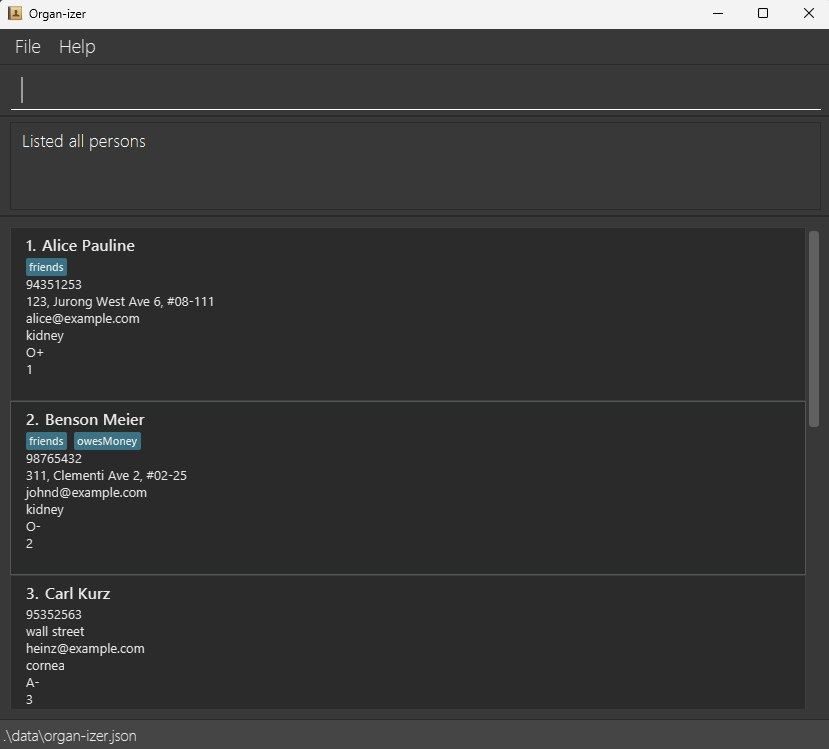

# Organ-izer

**Organi-zer** is a desktop application that **manages a database of organ donor recipients**.
It is intended for **organ donation coordinators** who require an **easy, fast, and efficient** way to
**navigate a database** and find the **right recipient**, during the **short time window** that an organ is available for donation.

* If you are interested in using **Organ-izer**, head over to the [_Quick Start_ section of the **User Guide**](UserGuide.html#quick-start).
* If you are interested about developing **Organ-izer**, the [**Developer Guide**](DeveloperGuide.html) is a good place to start.

**Acknowledgements**

* **Organ-izer** is based on the existing [AddressBook Level 3 (AB3)](https://se-education.org/addressbook-level3/UserGuide.html) project.

* Libraries used: [JavaFX](https://openjfx.io/), [Jackson](https://github.com/FasterXML/jackson), [JUnit5](https://github.com/junit-team/junit5)
